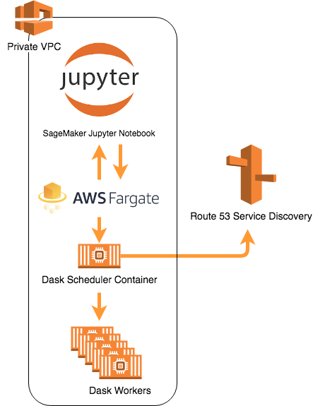

# aws-dask-sm-fargate
Perform data science and ML with Dask on AWS SageMaker and Fargate.

# Architecture

## Implementing Distributed Dask on AWS Fargate

1)  Install AWS CLI - https://docs.aws.amazon.com/cli/latest/userguide/cli-chap-install.html
2)	Log into your AWS account and choose your region
3)  Clone this project: https://github.com/rvvittal/aws-dask-sm-fargateFrom and from project root: cd ECS-Dask/base-image
4)	Build docker dask image: docker build -t dask .
5)	Create ECR repo "dask" using the following instruction: - https://docs.aws.amazon.com/AmazonECR/latest/userguide/repository-create.html
6)	Login to your ECR repo from AWS CLI. Get login command from "View Push Commands" from your ECR repo AWS console.
7)	Tag the dask image you built earlier for registering it into ECR.  Get this command from "View Push Commands" from your ECR repo AWS console. 
8)	Push the above tagged dask image to ECR. Get this command from "View Push Commands" from your ECR repo AWS console. 
9)  Use CloudFormatin Console to provision VPC network resources using vpc-public-private.yaml located in project root.
10)	Use CloudFormation Console to provision Fargate cluster using dask-cluster.template located in project root.  Select VPC/private subnet(output from above stack) to deploy the dask fargate cluster and follow the prompts to create the stack.
11)	 Create SageMaker notebook instance
a)	Create new role with default options  
b)	Under Network Choose VPC/private subnet and security group created from stack
c)	Disable direct internet access
12)	 Upload dask-sm-fargate-example notebook from your local device to SageMaker notebook instance or clone the github repo from SageMaker Notebook terminal

## Setup Network Load Balancer for monitoring Fargate Dask Cluster

1.	Create a public subnet in the same AZ where the private subnet was created
2.	Create NLB on the above public subnet with listener port as TCP 80
3.	Under AZs section, choose VPC you created above and choose public subnet in the same AZ where Dask Cluster is running.
4.	Under configure routing, choose protocol as TCP, port as 8787 and target type as IP
5.	Under register targets, choose your VPC and copy the private IP for the dask-scheduler task instance that can be found under Amazon ECS > Clusters > Fargate-Dask-Cluster > Dask-Scheduler > Tasks > Task 
6.	Select the security group associated to SageMaker notebook and add this inbound rule to allows NLB port 80 traffic via the forwarded 8787 port:  Custom TCP, 8787, your NLB public subnet IP range

## EDA on SageMaker notebook with Fargate Dask Cluster

1.  Navigate to Amazon ECS > Clusters and ensure Fargate-Dask-Cluster is running with 1 task each for Dask-Scheduler and Dask-Workers
2.  Execute each cell of the notebook and observe the results. 
3.  Use the network load balance public DNS to monitor the performance of the cluster as you execute the notebook cells.

